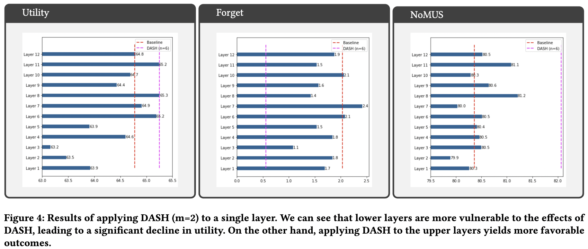
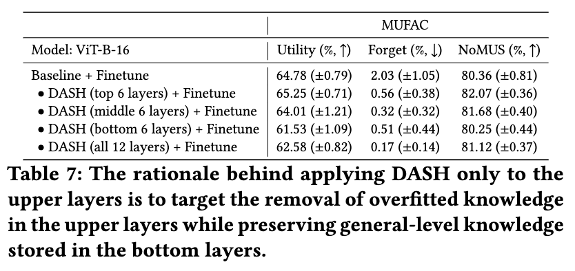

## < Elucidating the rationales behind DASH >

  

### Experiment 2.1 Top 6 layers vs. Middle 6 layers vs. Bottom 6 layers vs. All 12 layers
***
We compared four variants of DASH: applying DASH to the top 6 layers, the middle 6 layers, the bottom 6 layers, and all 12 layers, to investigate its impact on unlearning performance. The results are summarized in Table 7 above, and we observed the following:
- [1] Applying DASH regularization to the bottom layers significantly hurts utility. We speculate that the general-level knowledge stored in the lower layers is crucial for maintaining utility and therefore more sensitive to DASH.
- [2] From the “forget” perspective, applying DASH to all 12 layers yields the best results. This aligns with Reviewer sCVm’s comment that bottom layers also contain data-specific knowledge.
- [3] Applying DASH to the top 6 layers results in the best utility and a decent forget score.
- **[Finding 2.1] As a result, these findings indicate that applying DASH to the upper layers can achieve a reasonable balance between utility and forgetting performance.**

### Experiment 2.2 Layer-wise DASH Results
***
We also conducted an additional ablation study where we applied DASH to only a single layer (with m=2) to explore how different layers react to DASH. The results are depicted in the figure above, and we observed the following:
- [4] Utility: Bottom layers tend to experience stronger utility degradation which is consistent with result [1] above. All bottom five layers show lower utility compared to the baseline. Conversely, upper layers mostly yield improved NoMUS scores. These results reaffirm that targeting the upper layers is effective for unlearning.
- [5] Forget Quality: Forget quality is relatively evenly distributed across layers, with most layers showing improved forget quality compared to the baseline. These results validate the effectiveness of duplicating the layers to remove stored knowledge. However, the forget quality is still considerably lower compared to our final DASH model (n=6, m=2), represented by the purple line. This indicates that applying DASH to multiple layers is crucial for better forget quality.
- **[Finding 2.2] Therefore, these findings suggest that applying DASH to multiple layers, rather than just a single layer, leads to significantly better unlearning performance.**

### Summary
***
Combining the two aforementioned results, the rationale behind why and how DASH yields effective unlearning becomes clear. By primarily targeting the upper layers, DASH can effectively remove overfitted knowledge from the upper layers while preserving the general-level knowledge in the bottom layers, which is crucial for maintaining utility. This results in a balanced trade-off between the utility and forget quality. These findings solidify the motivation behind DASH explained in Section "3.1 Motivation".
